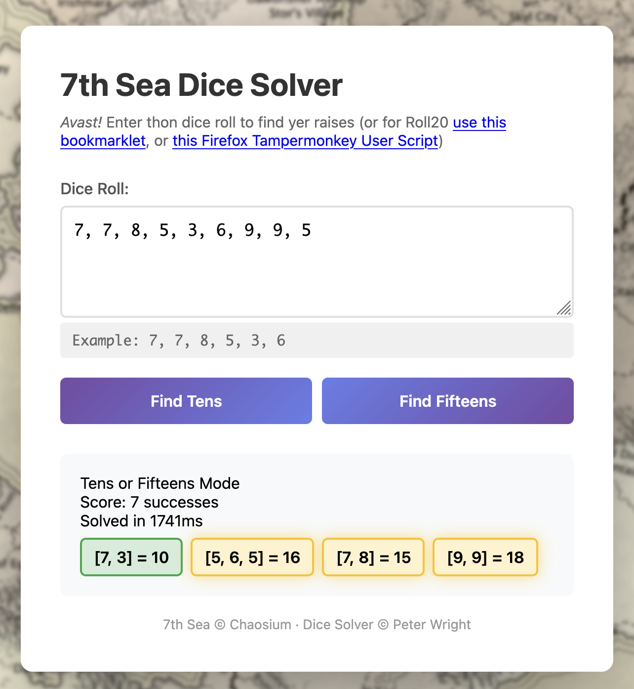

# 7th Sea Dice Solver

See [live site](https://petergeneric.github.io/7thsea-dice-solver) to use this tool

## What is this project?

In the [7th Sea 2e TTRPG](https://www.chaosium.com/7th-sea-quickstarts/), players roll a number D10s to achieve actions. These dice are then arranged into groups, with a group with a face value of 10+ being worth one "raise" (success), or if their character is highly skilled in what they have rolled, a group of value 15+ being worth two raises.

This can be challenging for online play, and for players who have dyscalculia.

This project allows players to enter their dice rolls (or, for Roll20, take advantage of the Bookmarklet to make skill rolls in the game chat clickable) and it will identify the best groupings to maximise their number of raises.

## How to use it

Simply load up [the live site](https://petergeneric.github.io/7thsea-dice-solver), enter your dice rolls separated by commas, and click "Find Tens" (which will find groups of 10+) or "Find Fifteens" (which will find groups of 15+ or 10+).

## How it works

The site loads up [minizinc.js](https://github.com/MiniZinc/minizinc-js) and runs a constraint optimisation solver trying to maximise the user's score. This is a reasonably simple problem to model as constraints.

While the solver is running, an animation plays (although the solver is fast enough that this rarely gets a chance to play for long, except for very large dice rolls)